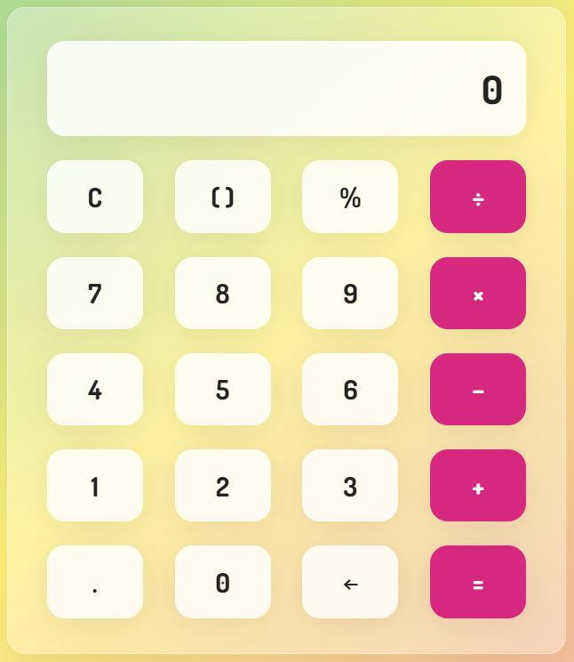

# Frosted Glass Calculator

A stylish web-based calculator built with **HTML, CSS, and JavaScript**, featuring a **frosted glass UI effect**, smooth gradient background, and button click sound feedback.

## ✨ Features

* 🎨 **Frosted Glass UI** using `backdrop-filter` for a modern, glass-like interface
* 🎶 **Button click sound** for interactive feedback
* 🧮 Supports:

  * Basic operations: `+`, `−`, `×`, `÷`
  * Parentheses `( )` handling
  * Decimal numbers
  * Percentage `%`
  * Backspace `←` and Clear `C`
* ⚡ Smart error handling for:

  * Division by zero → `"Undefined!"`
  * Indeterminate results → `"Indeterminate value!"`
  * Invalid inputs → `"Error"`

## 📂 Project Structure

```
calculator/
│── index.html          # Main calculator UI  
│── style.css           # Frosted glass styling & layout  
│── script.js           # Calculator logic & interactivity
│── LICENSE             # Free and Open Source Licence 
│── README.md           # Project documentation  
│── media/  
│   ├── calculator-preview.png  # Screenshot for README  
│   ├── click.mp3               # Button click sound  
│   └── favicon.ico             # Website icon  
```

## 🖼️ UI Preview

* Gradient background with frosted glass effect
* Rounded, glassy buttons with hover/active states
* Responsive layout with centered calculator
* Here’s a preview of the calculator:



## 🔧 How to Run

1. Clone or download this repository
2. Open `index.html` in your browser
3. Start calculating 🎉

## 🎵 Credits

* Click sound: [Pixabay - freesound\_community](https://pixabay.com/users/freesound_community-46691455/?utm_source=link-attribution&utm_medium=referral&utm_campaign=music&utm_content=102918)

## 📚 Learning Value

This project was my **first official JavaScript project** 🎉

* It helped me understand the **basics of JavaScript**, such as:

  * DOM manipulation (`querySelector`, `addEventListener`)
  * Conditional logic (`switch`, `if/else`)
  * Error handling with `try...catch`
  * Regular expressions for input validation
* Also improved my **HTML & CSS knowledge** by building a modern, frosted-glass styled UI.

Building this calculator gave me confidence in working with **JavaScript fundamentals** and taught me how to connect logic with user interaction.

---
